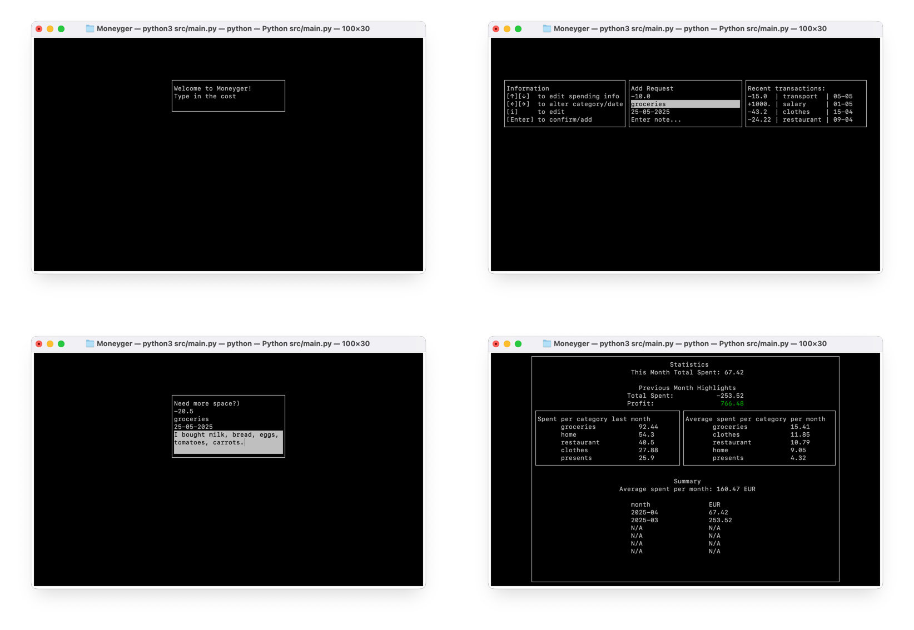

# Moneyger

A terminal app to track your personal spending with complete control over your data.

Built with the Python `curses` library and an SQLite database.

### Preview


<!--  -->

To start adding your transactions, enter the amount and press `Enter`. You can also add a description, category, and date. The app will automatically save your data to the database. To change the category, date, or description, navigate to the line and press `i`. Press `Enter` to save changes, and press `Enter` again to submit the transaction.

Use arrows `↑`, `↓` to navigate between transaction metadata and `←`,`→` to scroll between differnet categories/dates.

To switch to the analysis screen, press `s` (stats). Here you can see your spending by category, date, and other statistics. You can return to the transactions screen by pressing `t` (transactions).

To exit the app, press `q` (quit).

### How to Use

1. Clone the repository:

   ```bash
   git clone https://github.com/redhoven/moneyger.git
   ```

2. Navigate to the project directory:

   ```bash
   cd moneyger
   ```

3. Install the required dependencies:

   ```bash
   python -m venv venv
   source venv/bin/activate  # On Windows use `venv\Scripts\activate`
   pip install -r requirements.txt
   ```

4. Run the app in the terminal:

   ```bash
   # Initialize the database when running for the first time
   python src/database.py --init
   python src/main.py
   ```

> \[!WARNING]
> Make sure your terminal is large enough to display the app properly. The recommended minimum size is 100x30 characters. The app will not start if the terminal window is too small.

5. If the app crashes or something isn't working properly, check the logs in the `moneyger.log` file.

### 📁 Project Structure

📂 `src/`

* `app.py` — Initializes and runs the core application logic
* `main.py` — Entry point: boots the app and starts the main loop
* `state.py` — Defines the shared state of the application
* `state_manager.py` — Controls navigation between screens based on current state
* `screen_manager.py` — Builds and manages the different screens
* `keys.py` — Centralized key mappings for input handling
* `database.py` — Handles all data persistence and retrieval logic
* `stats.py` — Gathers and processes database stats for visual display
* `parsers.py` — Parses incoming input data into structured form

#### 📂 `screens/` — All screen definitions:

* `screen.py` — Abstract base class for all screens
* `main_screen.py` — Home screen for general interactions
* `extended_screen.py` — Transaction screen with history and guidance
* `analysis_screen.py` — Visualizes data insights and trends

### Component Responsibilities

**App (`app.py`)**
Orchestrates the entire application lifecycle. Initializes core modules and performs actions based on the current shared state.

**State Manager (`state_manager.py`)**
Handles screen transitions by monitoring updates in the shared state.

**Shared State (`state.py`)**
Central storage for app state, responsible for consistent and reactive behavior across screens.

**Screen (`screens/*.py`)**
Each screen:

* Renders its UI content
* Handles user key inputs
* Returns a potential new state

**Statistics (`stats.py`)**
Pulls data from the database and transforms it into processed insights.

**Database (`database.py`)**
Low-level data layer responsible for CRUD operations and persistent storage.
